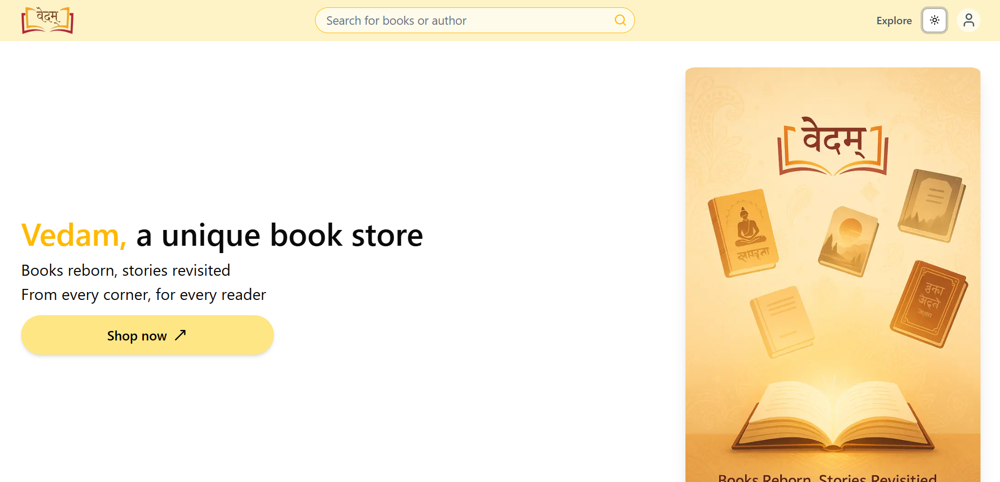
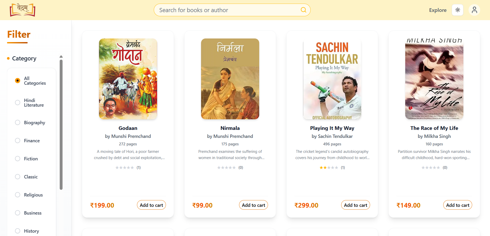
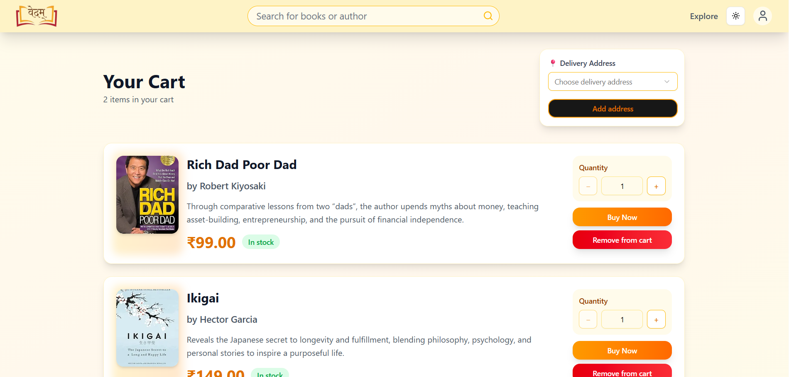
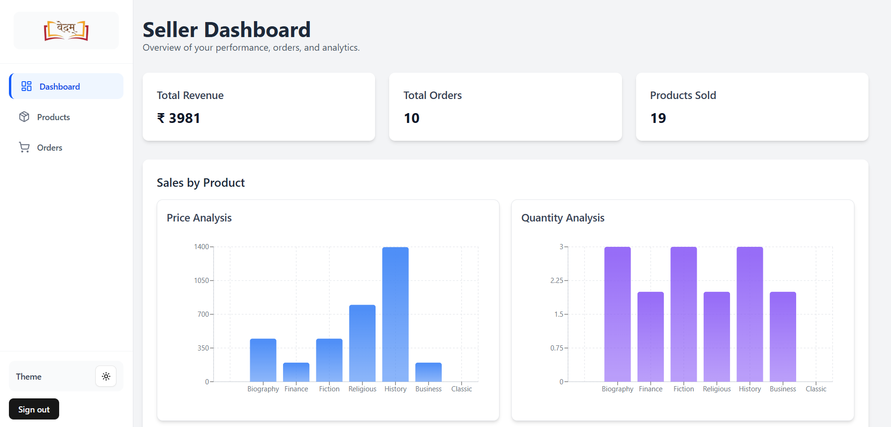
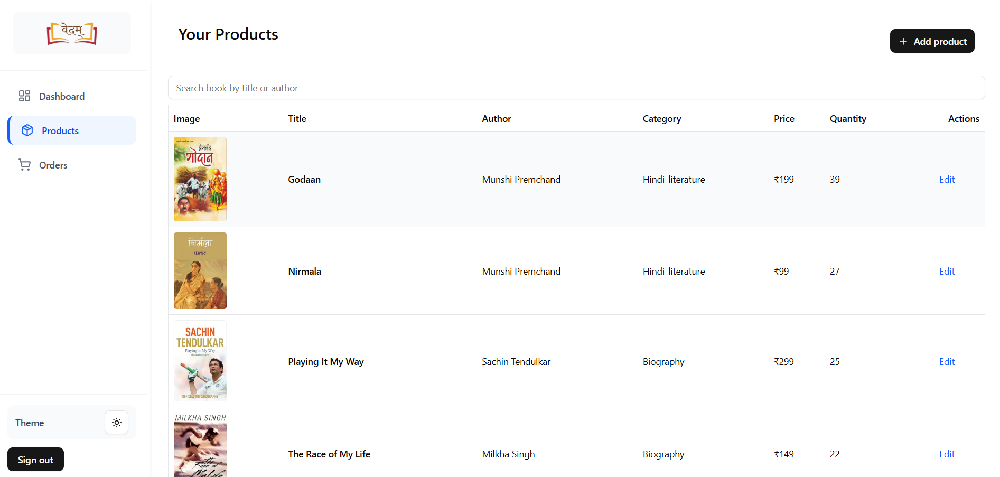
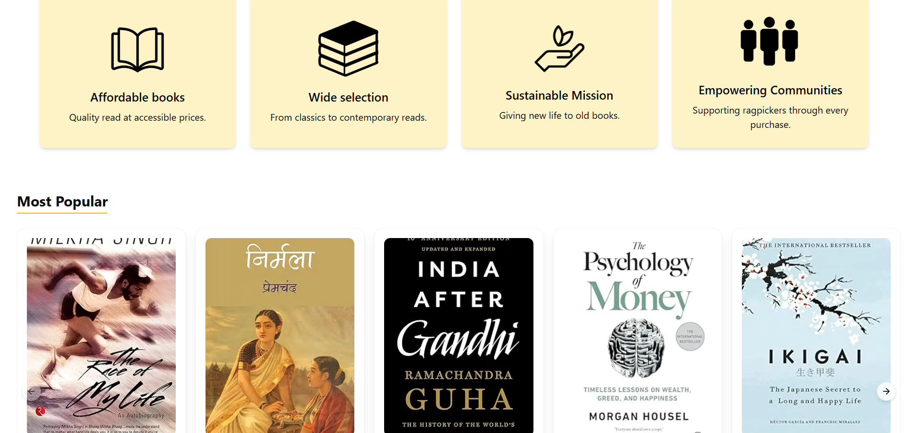
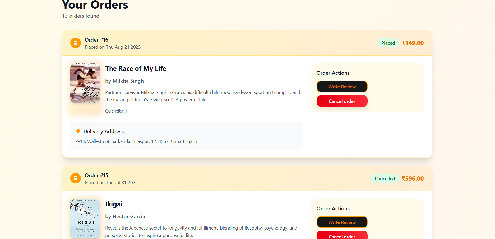
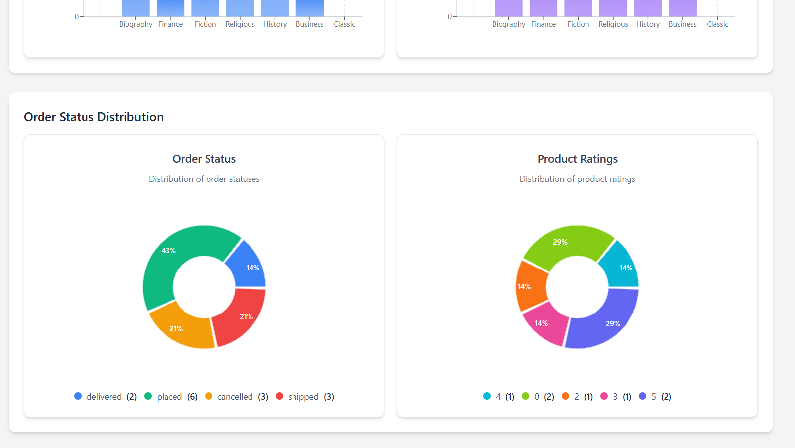
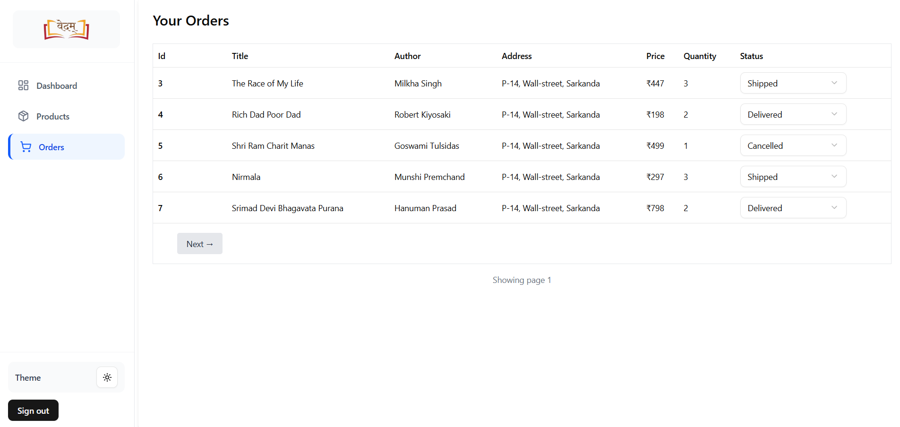

# 📚 Vedam - Democratizing Book Access Through Technology

> **Making books affordable and accessible for everyone, one page at a time.**

Vedam is more than just another e-commerce platform—it's a mission-driven solution that bridges the gap between book lovers and affordable literature. By empowering independent sellers, including ragpickers and small vendors, to list books while providing buyers with a seamless shopping experience, Vedam creates a sustainable ecosystem for book circulation.



## 🌟 Why Vedam?

In a world where books can be expensive and inaccessible, Vedam stands as a beacon of hope. We believe that knowledge shouldn't be limited by economic barriers. Our platform:

- **Empowers the community** by giving independent sellers a digital storefront
- **Reduces book waste** by promoting the circulation of pre-owned books  
- **Makes reading affordable** through competitive pricing and diverse inventory
- **Creates opportunities** for marginalized communities to participate in the digital economy

## ✨ Features That Matter

### 🛒 For Book Lovers (Buyers)

**Seamless Discovery & Shopping**
- **Smart Authentication** - Secure sign-in/sign-up with robust validation
- **Curated Landing Page** - Discover trending and top-rated books at a glance
- **Advanced Product Search** - Find exactly what you're looking for with pagination, category filters, and price ranges
- **Detailed Product Pages** - Complete book information, ratings, and reviews to make informed decisions



**Effortless Shopping Experience**
- **Intuitive Cart Management** - Add, update quantities, or remove items with ease
- **Secure Checkout** - Stripe-powered payments ensure your transactions are safe
- **Order Tracking** - Monitor your orders from placement to delivery
- **Purchase History** - Access all your past orders and reorder favorites



### 🛍️ For Sellers & Admins

**Comprehensive Dashboard**
- **Business Analytics** - Track revenue, sales performance, and customer satisfaction
- **Visual Insights** - Beautiful charts showing category performance, order status distribution, and ratings analysis
- **Real-time Metrics** - Stay updated with your business performance



**Powerful Management Tools**
- **Product Management** - Add, edit, and organize your book inventory with ease
- **Order Processing** - Efficiently manage orders and update delivery status
- **Inventory Insights** - Understand which books are performing best



## 🛠️ Built With Modern Technology

### Frontend Excellence
- **Next.js with TypeScript** - Server-side rendering for optimal performance
- **React** - Component-based architecture for maintainable code
- **Tailwind CSS + ShadCN UI** - Beautiful, responsive design system
- **React Hook Form + Zod** - Type-safe forms with robust validation
- **Recharts** - Interactive data visualizations

### Backend Power
- **Next.js API Routes** - Seamless full-stack integration
- **Prisma ORM** - Type-safe database operations
- **PostgreSQL** - Reliable, scalable database
- **Stripe API** - Secure payment processing
- **NextAuth.js** - Authentication and session management

### Key Technical Features
- **Role-based Access Control** - Secure separation between buyers and sellers
- **Advanced Pagination** - Efficient data loading and navigation
- **Real-time Search** - Instant results as you type
- **Toast Notifications** - User-friendly feedback system
- **Responsive Design** - Optimized for all devices

## 🚀 Getting Started

### Prerequisites
- Node.js (v18 or higher)
- PostgreSQL database
- Stripe account for payments

### Installation

1. **Clone the repository**
   ```bash
   git clone https://github.com/Shreyansh-32/Vedam2/vedam.git
   cd vedam
   ```

2. **Install dependencies**
   ```bash
   npm install
   # or
   yarn install
   ```

3. **Set up environment variables**
   ```bash
   cp .env.example .env.local
   ```
   
   Fill in your environment variables:
   ```env
   DATABASE_URL="your_postgresql_connection_string"
   NEXTAUTH_SECRET="your_nextauth_secret"
   NEXTAUTH_URL="http://localhost:3000"
   STRIPE_SECRET_KEY="your_stripe_secret_key"
   STRIPE_PUBLISHABLE_KEY="your_stripe_publishable_key"
   ```

4. **Set up the database**
   ```bash
   npx prisma generate
   npx prisma db push
   npx prisma db seed
   ```

5. **Start the development server**
   ```bash
   npm run dev
   # or
   yarn dev
   ```

6. **Open your browser** and visit `http://localhost:3000`

## 📊 Project Structure

```
vedam/
├── app/                # Next.js pages and API routes
├── components/         # Reusable UI components
├── prisma/             # Database schema and migrations
├── public/             # Static assets
├── lib/                # Utility functions and configurations
├── types/              # TypeScript type definitions
└── hooks/              # Custom React hooks
```

## 🎯 Roadmap

- [ ] **Mobile App** - React Native implementation
- [ ] **AI Recommendations** - Personalized book suggestions
- [ ] **Book Exchange Program** - Direct book swapping between users
- [ ] **Multilingual Support** - Making Vedam accessible globally
- [ ] **Seller Analytics API** - Advanced insights for power sellers
- [ ] **Social Features** - Book reviews, wishlists, and community discussions

## 🤝 Contributing

We welcome contributions from developers who share our vision of making books accessible to everyone!

1. Fork the repository
2. Create your feature branch (`git checkout -b feature/AmazingFeature`)
3. Commit your changes (`git commit -m 'Add some AmazingFeature'`)
4. Push to the branch (`git push origin feature/AmazingFeature`)
5. Open a Pull Request

## 📸 Screenshots

### User Interface


*Clean, intuitive homepage showcasing featured books*


*Advanced filtering and search capabilities*


*Comprehensive order management for buyers*

### Admin Panel

*Comprehensive business insights and metrics*


*Efficient order processing and status updates*

## 🙏 Acknowledgments

- Thanks to all the independent sellers who make affordable books possible
- Inspired by the belief that education should be accessible to everyone
- Built with love for the reading community

## 📞 Support

If you encounter any issues or have questions:

- 🐛 Issues: [GitHub Issues](https://github.com/Shreyansh-32/Vedam2/issues)
- 💬 Discussions: [GitHub Discussions](https://github.com/Shreyansh-32/Vedam2/discussions)

---

<div align="center">

**Made with ❤️ for the love of books and accessible education**

[⭐ Star this repo](https://github.com/Shreyansh-32/Vedam2/vedam) | [🐛 Report Bug](https://github.com/Shreyansh-32/Vedam2/issues) | [💡 Request Feature](https://github.com/Shreyansh-32/Vedam2/issues)

</div>
